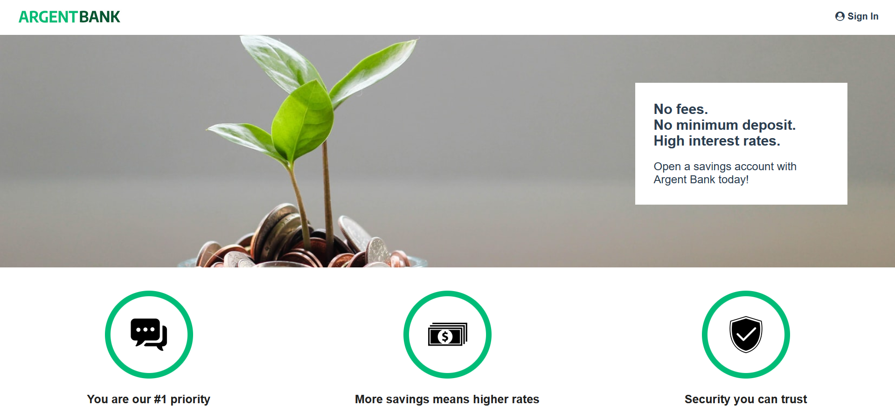

# App using an API for a bank's account user with React

This app is based on React where users can sign to their bank's account and modify their personnal data.
The file explains how to install the app (frontEnd and backEnd) and how to execute it.
Before installing this app you need to fulfill all prerequisites indicated below.
Detailed explanations are given about frontEnd'app and backEnd's app setup.

## Developed with:

- <a href="https://fr.legacy.reactjs.org/">React</a>
- <a href="https://redux.js.org/">Redux</a>
- <a href="https://reactrouter.com/en/main">React-Router</a>
- <a href="https://axios-http.com/">Axios for HTTP requests</a>

## Prerequisites for the FrontEnd's app

- Install npm => <a href='https://nodejs.org/en'>https://nodejs.org/en</a>

## Setup

### Run backEnd's app

- The backEnd's app was made by the Openclassrooms's team
- Go to the repository below and follow the instructions to install and execute backEnd's app:

    <a href="https://github.com/MilovanovicAlexandre/Project-10-Bank-API">https://github.com/MilovanovicAlexandre/Project-10-Bank-API</a>

### Run FrontEnd's app
#### Download this repository on your computer

- Enter the following command in your computer terminal:

    git clone <a href="https://github.com/MilovanovicAlexandre/utilisez-une-api-pour-un-compte-utilisateur-bancaire-avec-react">https://github.com/MilovanovicAlexandre/utilisez-une-api-pour-un-compte-utilisateur-bancaire-avec-react</a>

#### Install and Launch frontEnd's app

- On your computer terminal go to the root of the repository

- Enter the following command in your computer terminal to install the dependencies:

    npm install

- Enter the following command in your computer terminal to run the Frontend's app:

    npm start

The Frontend'app is now available on: <a href='http://localhost:3000/Home'>http://localhost:3000/Home</a>